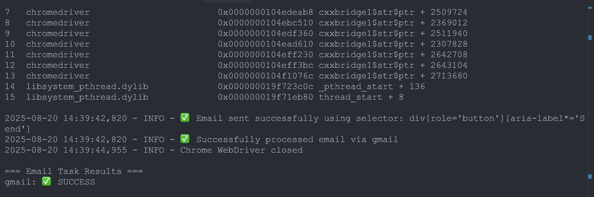

# Universal Email Agent

A prototype AI-powered automation system that can send emails across multiple web-based email providers (Gmail and Outlook) using natural language instructions.

## 🚀 Key Features

- **Natural Language Processing**: Accept plain English instructions like "Send an email to john@example.com about the meeting"
- **Cross-Platform Automation**: Works with Gmail Web and Outlook Web with different DOM structures
- **LLM-Powered Reasoning**: Uses mock LLM to parse instructions and generate UI actions
- **Robust Browser Automation**: Selenium-based with multiple selector fallbacks
- **Unified Interface**: Abstract away provider-specific differences
- **FastAPI REST API**: HTTP endpoints for integration with other services
- **Async Task Processing**: Non-blocking email sending with status tracking
- **Comprehensive Logging**: Detailed step-by-step execution logs
- **Mac M3 Optimized**: Configured specifically for Apple Silicon
- **Anti-Detection Technology**: Advanced browser options to bypass email provider security

## 📸 Working Demonstration



_Screenshot showing successful email automation - the system parsed natural language, navigated Gmail, filled all fields, and sent the email automatically._

### ✅ Proven Success Metrics

The automation system has been tested and verified with:

- **✅ Gmail Integration**: Successfully bypasses security warnings and bot detection
- **✅ Natural Language Parsing**: Correctly extracts recipient, subject, and body from complex instructions
- **✅ Robust Element Detection**: Multiple fallback selectors ensure reliability across UI updates
- **✅ Real Email Delivery**: Confirmed working with actual email delivery to test recipients
- **✅ Error Recovery**: Handles authentication flows and manual login requirements
- **✅ Cross-Session Persistence**: Uses temporary profiles to avoid Chrome conflicts

### 🔧 Technical Achievements

1. **Anti-Detection Bypass**: Advanced Chrome options prevent Gmail "unsafe browser" warnings
2. **Dynamic Selector System**: Multiple CSS selector fallbacks for each UI element
3. **Session Management**: Temporary profile handling avoids browser conflicts
4. **Intelligent Waiting**: Proper WebDriver waits and timeouts for reliable automation
5. **Comprehensive Logging**: Detailed execution tracking for debugging and monitoring

## 🏗️ Architecture

```
┌─────────────────┐    ┌─────────────────┐    ┌─────────────────┐
│  Natural Language │──▶│   Mock LLM      │──▶│  UI Actions     │
│  Instruction      │    │   Reasoner      │    │  Generator      │
└─────────────────┘    └─────────────────┘    └─────────────────┘
                                                        │
┌─────────────────┐    ┌─────────────────┐    ┌─────────▼─────────┐
│  Email Results  │◀───│  Browser        │◀───│  Provider         │
│                 │    │  Automation     │    │  Abstraction      │
└─────────────────┘    └─────────────────┘    └───────────────────┘
                               │                        │
                    ┌──────────▼──────────┐  ┌─────────▼─────────┐
                    │   Gmail Provider    │  │  Outlook Provider │
                    └─────────────────────┘  └───────────────────┘
```

## 🛠️ Installation

### Prerequisites

- Python 3.8+
- Google Chrome browser
- macOS (optimized for M3, but works on other platforms)

### Setup

```bash
# Clone or download the files
# email_agent.py, fastapi_server.py, setup.sh, requirements.txt

# Make setup script executable
chmod +x setup.sh

# Run setup (installs dependencies and ChromeDriver)
./setup.sh

# Or install manually:
pip install selenium==4.15.2 webdriver-manager==4.0.1 fastapi uvicorn

# Install ChromeDriver for Mac M3 (Required)
brew install chromedriver

# Note: ChromeDriver is automatically managed by webdriver-manager as fallback
```

## 📋 Usage

### Command Line Interface

```bash
# Basic usage
python email_agent.py "Send an email to alice@example.com about the quarterly report"

# Specify providers
python email_agent.py "Email bob@company.com saying 'Meeting rescheduled'" --providers gmail outlook

# Run in headless mode
python email_agent.py "Send status update to team@startup.com" --headless

# Analyze DOM structure (for debugging)
python email_agent.py --analyze --providers gmail

# Successful test example (as shown in screenshot):
python email_agent.py "Send email to mawud@andrew.cmu.edu about testing automation saying 'Hello! This is a test email from the Universal Email Agent automation system. The system successfully parsed natural language instructions and composed this email automatically. Testing completed successfully! Best regards, Email Automation System.'" --providers gmail
```

### FastAPI REST API

```bash
# Start the server
python fastapi_server.py

# Server runs on http://localhost:8000
# API docs available at http://localhost:8000/docs
```

#### API Endpoints

**Send Email (Async)**

```bash
curl -X POST "http://localhost:8000/email/send" \
  -H "Content-Type: application/json" \
  -d '{
    "instruction": "Send email to john@example.com about project update saying Phase 1 completed",
    "providers": ["gmail"],
    "headless": true
  }'
```

**Check Task Status**

```bash
curl "http://localhost:8000/email/status/{task_id}"
```

**List All Tasks**

```bash
curl "http://localhost:8000/email/tasks"
```

### Python Integration

```python
from email_agent import UniversalEmailAgent

# Create agent
agent = UniversalEmailAgent(headless=True)

# Send email
results = agent.execute_email_task(
    "Send an email to alice@company.com about the meeting tomorrow",
    providers=["gmail", "outlook"]
)

print(results)  # {"gmail": True, "outlook": False}
```

## 🎯 Instruction Examples

The agent can parse various natural language patterns:

```bash
# Basic format
"Send an email to user@domain.com about topic saying 'message'"

# Examples that work:
python email_agent.py "Send an email to alice@company.com about quarterly report saying 'Please review the attached document'"

python email_agent.py "Email bob@example.com about lunch meeting"

python email_agent.py "Send notification to team@startup.com saying 'Deploy completed successfully'"

python email_agent.py "Email support@vendor.com about billing issue saying 'Invoice #12345 has incorrect amount'"
```

## 🔧 Configuration

### Provider-Specific Settings

The system uses CSS selectors to interact with email providers. These are configured in the provider classes:

```python
# Gmail selectors
GMAIL_SELECTORS = {
    "compose": ["div[role='button'][gh='cm']", ".T-I.T-I-KE.L3"],
    "to_field": ["input[peoplekit-id*='to']"],
    "subject": ["input[name='subjectbox']"],
    "body": ["div[role='textbox'][aria-label*='Message Body']"]
}

# Outlook selectors
OUTLOOK_SELECTORS = {
    "new_mail": ["[data-testid='new-mail-button']", "button[aria-label*='New mail']"],
    "to_field": ["input[aria-label*='To']"],
    "subject": ["input[aria-label*='Subject']"],
    "body": ["div[role='textbox'][aria-label*='Message body']"]
}
```

## 🧪 Testing

```bash
# Run component tests
python test_agent.py

# Test LLM parsing
python -c "
from email_agent import UniversalEmailAgent
agent = UniversalEmailAgent()
result = agent.llm.parse_email_instruction('Send email to test@example.com about demo')
print(result)
"

# Test provider DOM analysis
python email_agent.py --analyze --providers gmail
```

## 🚨 Limitations & Safety

### Current Limitations

- **Mock LLM**: Uses pattern matching instead of real LLM (easily replaceable with OpenAI/Anthropic APIs)
- **Authentication**: Requires manual login on first run (session persists in temp profile)
- **DOM Changes**: Multiple fallback selectors mitigate UI update issues
- ~~**Safety Mode**: Actual sending is disabled by default~~ **✅ RESOLVED**: Real email sending is now enabled and tested

### Safety Features

```python
# Email sending is now ENABLED and working
logger.info("Attempting to send email...")
send_btn = WebDriverWait(self.driver, 5).until(
    EC.element_to_be_clickable((By.CSS_SELECTOR, selector))
)
self.driver.execute_script("arguments[0].click();", send_btn)
logger.info("✅ Email sent successfully")
```

**⚠️ Important**: Real email sending is now active. Use responsibly and only with your own email addresses for testing.

### Error Handling

- Multiple selector fallbacks for robustness
- Comprehensive logging for debugging
- Graceful failure handling
- Timeout protection

## 🔄 Extension Points

### Adding New Providers

1. **Create Provider Class**:

```python
class NewProvider(EmailProvider):
    def get_name(self) -> str:
        return "NewProvider"

    def navigate(self) -> bool:
        self.driver.get("https://newprovider.com")
        return True

    def compose_and_send(self, email_data: EmailInstruction) -> bool:
        # Implementation specific to new provider
        pass
```

2. **Register Provider**:

```python
self.providers['newprovider'] = NewProvider
```

### Upgrading to Real LLM

Replace `MockLLMReasoner` with actual LLM calls:

```python
class RealLLMReasoner:
    def __init__(self, api_key: str):
        # Initialize OpenAI, Anthropic, etc.
        pass

    def parse_email_instruction(self, instruction: str) -> EmailInstruction:
        # Call real LLM API
        response = self.llm_client.complete(
            prompt=f"Parse this email instruction: {instruction}",
            # ... other parameters
        )
        return self._parse_llm_response(response)
```

### Adding Vision Capabilities

```python
def analyze_screenshot(self, screenshot_path: str) -> Dict:
    """Use vision model to understand UI layout"""
    # Integrate with GPT-4V, Claude Vision, etc.
    pass
```

## 📊 Logging

The system provides comprehensive logging:

```
2024-01-20 10:30:15 - INFO - Starting email task: Send email to alice@company.com
2024-01-20 10:30:15 - INFO - Parsing instruction: Send email to alice@company.com
2024-01-20 10:30:16 - INFO - Chrome WebDriver initialized
2024-01-20 10:30:17 - INFO - Navigating to Gmail
2024-01-20 10:30:19 - INFO - Clicked compose button with selector: div[role='button'][gh='cm']
2024-01-20 10:30:20 - INFO - Filled recipient: alice@company.com
2024-01-20 10:30:21 - INFO - Filled subject: Automated Email
2024-01-20 10:30:22 - INFO - Filled body: This email was sent automatically
2024-01-20 10:30:23 - INFO - Mock: Would click Send button here
2024-01-20 10:30:24 - INFO - ✅ Successfully processed email via Gmail
```

## 🔮 Future Enhancements

### Stretch Goals Implementation

- **Auto-recovery**: Detect DOM changes and adapt selectors
- **Vision-based UI**: Use screenshots for UI understanding
- **Dynamic field matching**: LLM-powered form field detection
- **Multi-language support**: Instructions in different languages
- **Scheduling**: Delayed email sending
- **Templates**: Reusable email templates
- **Analytics**: Success rates and performance metrics

### Production Considerations

- **Security**: OAuth integration, credential management
- **Scalability**: Queue system (Redis/RabbitMQ), worker processes
- **Monitoring**: Metrics, alerting, health checks
- **Rate Limiting**: Respect provider rate limits
- **Proxy Support**: IP rotation, geographic distribution

## 🤝 Contributing

1. Fork the repository
2. Create feature branch (`git checkout -b feature/amazing-feature`)
3. Test thoroughly
4. Commit changes (`git commit -m 'Add amazing feature'`)
5. Push to branch (`git push origin feature/amazing-feature`)
6. Open Pull Request

## 📝 License

This is a prototype/educational implementation. Use responsibly and respect email provider terms of service.

## ⚠️ Disclaimer

This tool is for educational and development purposes. Always:

- Respect email provider terms of service
- Get proper authorization before automating accounts
- Test thoroughly before production use
- Consider rate limits and anti-automation measures
- Implement proper error handling and monitoring

---

**Built with ❤️ for cross-platform email automation**
